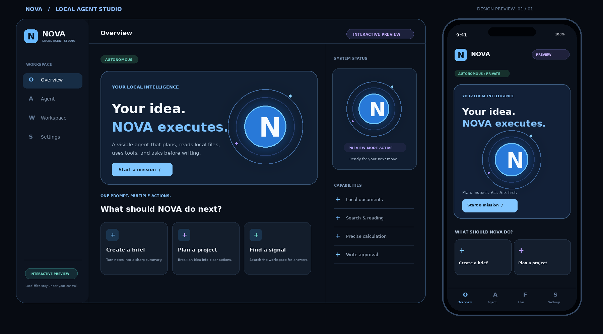

# NOVA · Local Agent Studio

Give NOVA a goal. Watch it inspect local documents, call tools, and ask before changing a file. The animated Expo UI runs on a computer browser, iPhone, and Android. A Node gateway connects a local Ollama model to a constrained workspace. There is no account, hosted backend, cloud database, or API key.



The image is a design preview of the implemented layout, not a device screenshot.

## Features

- **Real agent loop:** Ollama chooses tools over multiple rounds and sees their results.
- **Visible execution:** timeline of tool calls, results, errors, approvals, and answer.
- **Human approval:** every file write pauses until approved or denied.
- **Narrow local access:** only flat `.md` and `.txt` files in `data/workspace`; no shell or internet tool.
- **Interactive preview:** clearly labelled scripted walkthrough, usable before installing a model. It never touches real files.
- **Cross-platform UI:** animated orbital core, dark glass panels, desktop rail, mobile navigation.

## Run on your computer

Install Node.js **22.13+** and [Ollama](https://ollama.com/download), then:

```bash
ollama pull qwen3:4b
npm ci
npm run seed
npm run build:web
npm run server
```

Open **http://localhost:8787**. The server terminal prints a pairing code. In Settings, enter that code and select **Local Agent**. Add your own `.md` or `.txt` documents in `data/workspace`. `npm run seed` adds three optional sample documents without overwriting existing ones.

On Windows PowerShell, the same npm commands work. For a different model set `$env:OLLAMA_MODEL="your-model"; npm run server`; on macOS/Linux use `OLLAMA_MODEL=your-model npm run server`.

## Use on a phone

Start the same computer server on your trusted Wi-Fi:

```bash
# macOS / Linux
HOST=0.0.0.0 npm run server
```

```powershell
# Windows PowerShell
$env:HOST="0.0.0.0"; npm run server
```

Find the computer's LAN IP (e.g. `192.168.1.10`). On the phone, open `http://192.168.1.10:8787` for the mobile browser UI. Or start `npm start`, scan its Expo Go QR code, and set the same LAN address in the app's Settings. Enter the pairing code from the computer terminal.

**`localhost` on a phone means the phone itself.** It cannot reach the computer's localhost. Ollama stays on the computer's `127.0.0.1:11434`; only NOVA's paired gateway is reachable over the LAN.

## Preview without Ollama

Run `npm ci && npm run build:web && npm run server`, then open the page and leave **Interactive Preview** selected. This walkthrough displays a scripted tool timeline and approval interaction, clearly marked as a preview. Real autonomous tasks require Ollama and a downloaded tool-capable model.

## Commands

| Command | Purpose |
| --- | --- |
| `npm run build:web` | Build browser UI into `dist/` |
| `npm run server` | Serve UI and local Agent API on port 8787 |
| `npm start` | Start Expo Go for iOS/Android development |
| `npm run seed` | Copy sample notes into the workspace |
| `npm run typecheck` | TypeScript check |
| `npm test` | Tool safety, approval, API pairing tests |

## Architecture

```text
Expo UI (browser / Android / iPhone)
  → paired local Node gateway (port 8787)
    → Ollama on computer (127.0.0.1:11434)
    → data/workspace/*.md and *.txt
```

The five tools are `list_files`, `read_file`, `search_files`, `calculate`, and approval-gated `write_file`. Each run has a step limit and can be cancelled. Task history is in memory; restart clears it without deleting documents. The pairing code uses plain HTTP within your LAN; add HTTPS and stronger authentication before access from untrusted networks. No public deployment is configured.

| Path | Purpose |
| --- | --- |
| `App.tsx`, `src/Orb.tsx`, `src/theme.ts` | UI and animation |
| `src/api.ts`, `src/demo.ts` | Gateway calls and labelled preview |
| `server/agent.mjs`, `server/tools.mjs`, `server/index.mjs` | Agent loop, safe tools, local server |
| `examples/workspace/` | Optional sample documents |

This is a local MVP. It has been typechecked, tested with mocked Ollama tool responses, and built for the web. A live model run and real-device visual QA require Ollama and a device on your machine.


## NEXUS · Packet Tracer integration

This branch can connect the local agent to Cisco Packet Tracer's Network Controller through Real World Access. The integration is read-only for now: the agent can inspect discovered devices and summarize reachability, but it does not push router, switch, ACL, or VLAN configuration changes.

Your current lab mapping is:

- `10.0.0.2` → `CORE-SW`
- `10.0.0.1` → `EDGE-RTR`
- Packet Tracer Controller REST API → `http://127.0.0.1:58000/api/v1`

Before starting the server on Windows PowerShell, set the controller credentials for the current terminal session:

```powershell
$env:PT_CONTROLLER_USERNAME="<controller username>"
$env:PT_CONTROLLER_PASSWORD="<controller password>"
npm run server
```

Keep Packet Tracer open with **NEXUS-CTRL → Config → Controller → Access Enabled** and port `58000` listening.

The NEXUS agent now has two additional tools:

- `get_network_devices` — gets the current controller inventory.
- `get_network_health` — counts reachable and unreachable discovered devices.

Example prompts in the app:

```text
Show me every network device currently discovered.
Is my Packet Tracer network healthy?
Which discovered device is the core switch?
```

Packet Tracer's simulated devices can report fields such as `collectionStatus: Unsupported` even while `reachabilityStatus` is `Reachable`. NEXUS therefore treats reachability as the primary online/offline signal and preserves the collection status as a separate field.


## NEXUS final command-center features

The current build goes beyond device inventory and adds an operator-style experience for the Packet Tracer lab:

- Animated interactive topology with live device and host nodes.
- Incident mode that highlights the simulated threat-marker host path.
- VLAN-aware trust zones for ADMIN, FINANCE, STAFF, GUEST, SERVER, and MANAGEMENT.
- Defensive security feed with explicit distinction between observed controller data and NEXUS heuristics.
- Rolling incident timeline snapshots.
- AI operator responses structured around Observed / Inferred / Risk / Next Checks / Confidence.
- Approval-gated defensive change plans with command and rollback previews.
- Automatic Ollama model fallback if the configured model is missing.
- Responsive desktop/mobile command center UI.

### Important safety / execution note

Defensive change plans are **preview-only** in this build. NEXUS can generate a reversible IOS command plan and record an approval or rejection, but it does not automatically push configuration to the simulated switch or router because the current Packet Tracer integration has not been given a verified write transport. The UI states this explicitly and never reports that a change was executed when it was only approved for preview.

To run the live lab:

```cmd
cd /d D:\gpt
set PT_CONTROLLER_USERNAME=admin
set PT_CONTROLLER_PASSWORD=cisco
npm install
npm run build:web
npm run server
```

Keep Packet Tracer open with NEXUS-CTRL Real World Access enabled on port 58000, then open `http://localhost:8787` and pair using the code shown in the terminal.


### Current verified release

The current command-center release includes the post-CI fix for React Native Web animation compatibility (`StyleSheet.absoluteFillObject` was replaced with explicit absolute positioning), plus the final animated topology, incident mode, SOC timeline, defensive-plan preview workflow, and AI operator console.
